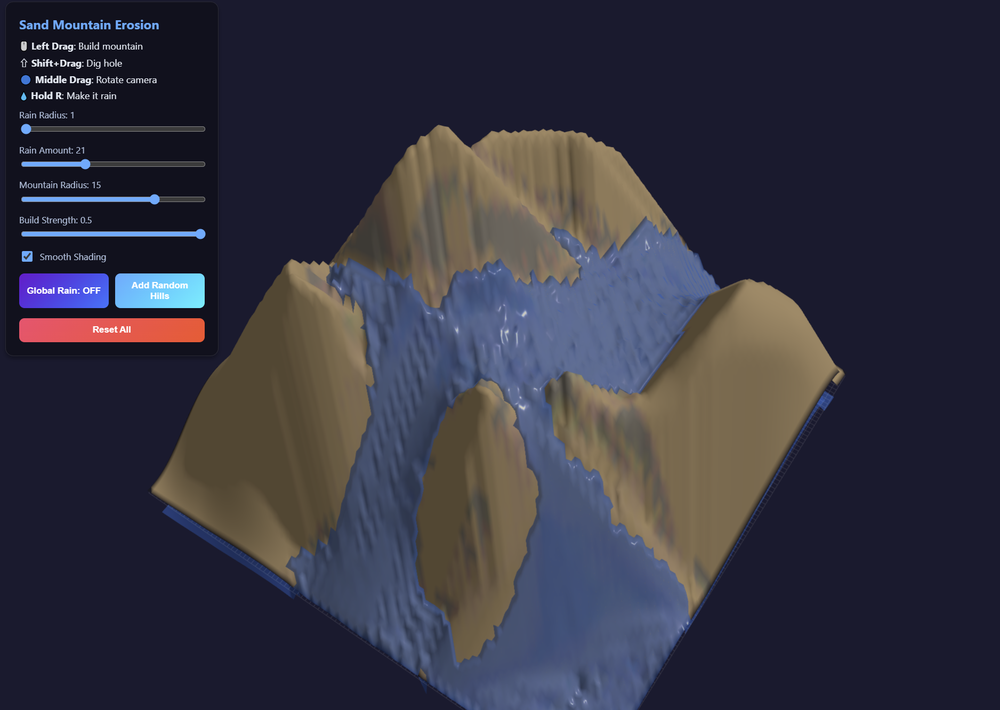

# 3D Erosion Simulation (砂山の侵食シミュレーション)

Three.js を使用した、リアルタイムの地形（砂山）侵食シミュレーターです。
ユーザーがマウス操作で山を作ったり穴を掘ったりすることができ、そこに降る「雨」によって地形が削れ、土砂が運ばれ、堆積していく様子をシミュレートします。

## 主な機能

-   **地形操作**: ブラシを使って直感的に山を作成（左ドラッグ）したり、穴を掘ったり（Shift+左ドラッグ）できます。
-   **水力侵食シミュレーション**: 浅水方程式（Shallow Water Equations）に近いグリッドベースの流体シミュレーションを搭載。
-   **土砂の運搬と堆積**: 流水の速度と勾配に応じて土砂が削れ、流れが緩やかな場所で堆積します。
-   **リアルタイム・レンダリング**: 平滑化（Smooth Shading）とフラットシェーディングの切り替えが可能。Zファイティング対策済み。
-   **ランダム地形生成**: ボタン一つで複雑な山脈を自動生成できます。
-   **全体降雨機能**: マップ全体に雨を降らせ、広範囲の侵食を一気に進めることが可能です。

## 操作方法

-   🖱️ **左ドラッグ**: 地形を盛り上げる（山を作る）
-   ⇧ + **左ドラッグ**: 地形を削る（穴を掘る）
-   🖱️ **右クリック保持**: マウス位置に雨を降らせる
-   ⌨️ **Rキー保持**: 右クリックと同様に雨を降らせる
-   🖱️ **中ボタン（ホイール）ドラッグ**: カメラの回転
-   🖱️ **右ドラッグ**: カメラの並行移動
-   🖱️ **スクロール**: ズームイン / アウト

## UI設定

-   **Rain Radius**: 雨が降る範囲の広さを調整します。
-   **Rain Amount**: 雨の強さ（1フレームあたりの滴数）を調整します。
-   **Mountain Radius**: 地形操作ブラシの大きさを調整します。
-   **Build Strength**: 地形変化の勢いを調整します。
-   **Smooth Shading**: 地形の見た目を滑らかにするか、ポリゴン感を出すか切り替えます。
-   **Global Rain**: 画面全体に雨を降らせるモードの ON/OFF です。
-   **Add Random Hills**: ランダムな位置と高さの山を複数生成します。
-   **Reset All**: すべての地形と水をリセットし、初期状態（更地）に戻します。

## 技術スタック

-   **Engine**: [Three.js](https://threejs.org/) (WebGL)
-   **Language**: Vanilla JavaScript (ES Modules)
-   **Algorithm**:
    -   Grid-based Fluid Simulation (Flux-based)
    -   Sediment Transport Capacity (Velocity & Slope based)
    -   Thermal Erosion (Slumping logic for slope stability)

## カスタマイズ

シミュレーションの細かい挙動（浸食速度、蒸発量、初期高さ制限など）は、`config.js` 内の定数を書き換えることで簡単に調整できます。

---

プロジェクトの詳細は [walkthrough.md](./brain/walking_through.md) (システム生成ドキュメント) も併せて参照してください。
